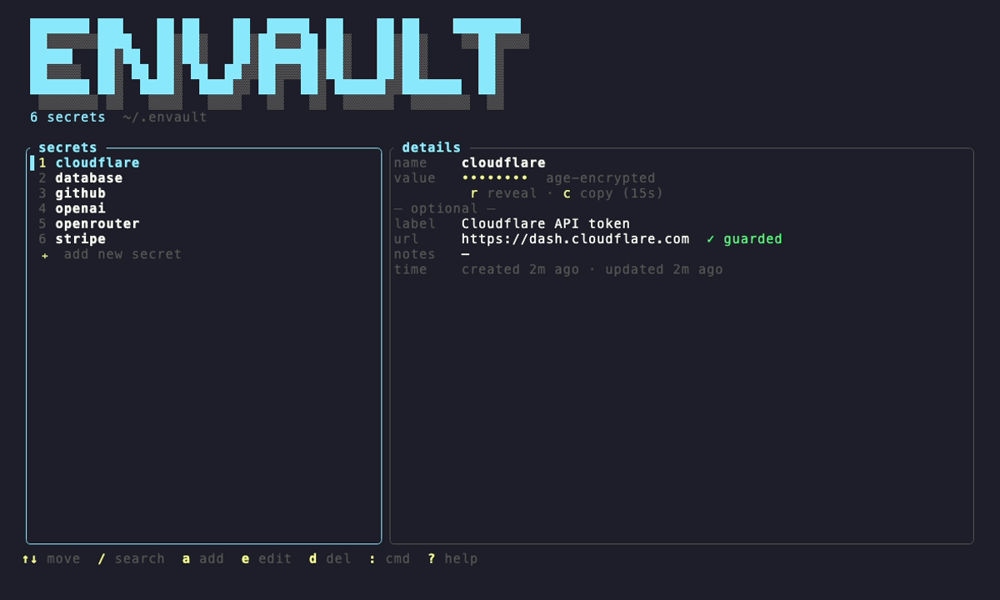
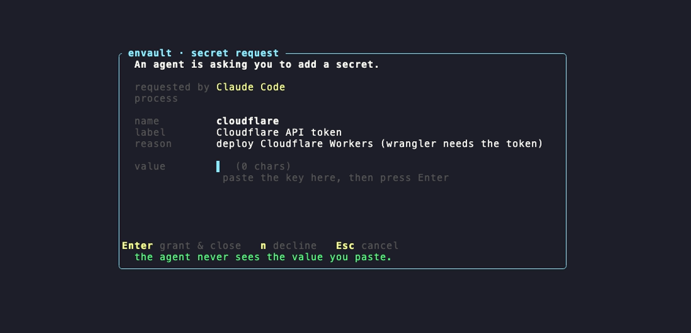
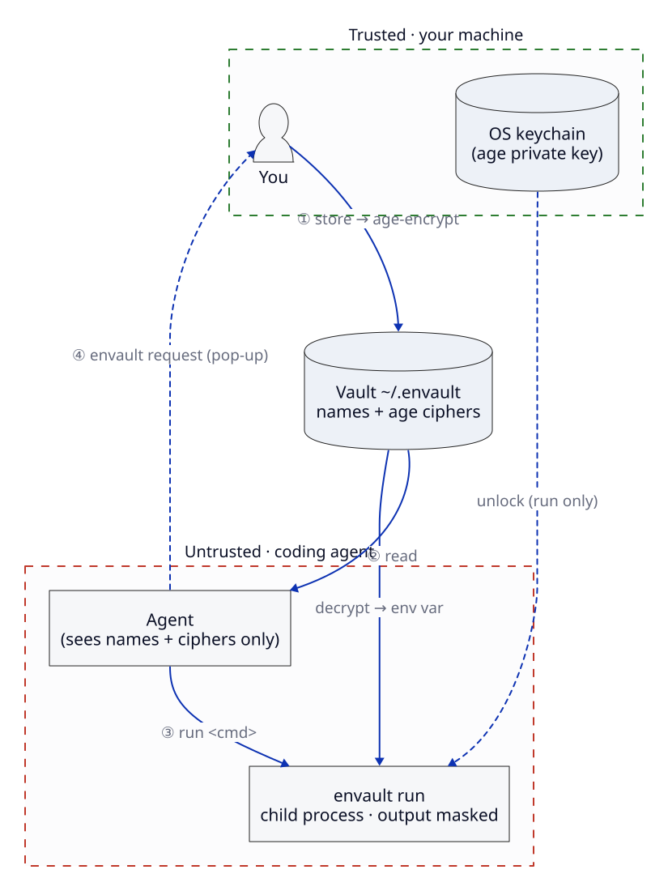

<div align="center">

# Envault

**A local, minimum, encrypted secrets vault for coding agents — let your AI works with your keys and secret, but never sees them.**


<br/>



</div>

---

Store your API keys, tokens, and passwords once. Your coding agent refers to them
**by name** and runs commands through envault — the plaintext only ever exists
inside the process envault launches, never in the model's context, a `.env`, or
your chat history.


> The only one command **you** run is **`envault`** — it opens the dashboard above,
> where you add keys and change settings. Every other `envault …` command below
> (`run`, `link`, `request`, …) is written by your **coding agent**, which learns
> them from the skill envault installs. You rarely type them yourself.

## Install

**Prebuilt binary — no Rust needed:**

```bash
curl -fsSL https://raw.githubusercontent.com/MildyNora/envault/master/install.sh | bash
```
```powershell
# Windows (PowerShell)
irm https://raw.githubusercontent.com/MildyNora/envault/master/install.ps1 | iex
```

Or **from source** (needs [Rust](https://rustup.rs)):

```bash
git clone https://github.com/MildyNora/envault.git && cd envault && ./install.sh
```

Any of these installs the binary, creates your vault, and sets up the agent skill.
Runs on macOS, Windows, and Linux; re-run to upgrade.

## 👤 For you — the dashboard

Run **`envault`**. Everything is inside the TUI (shown above): add and edit
secrets, toggle **Touch ID** and the **audit log**, and **rotate** your keypair —
no commands to memorize. Changing a setting or rotating is gated behind Touch ID /
Windows Hello, so an agent can't do it in your place.

## 🤖 For your agents - they see ciphers

Your agent only ever sees **names and age-encrypted ciphers**. It maps a name to
an environment variable and runs your command through envault, which injects the
real value and **masks it out of the output**:

```console
$ envault link OPENAI_API_KEY openai
$ envault run -- python app.py      # value injected · output masked
```

When it needs a key you haven't stored, it would not ask you to paste it into chat —
it **requests**  a window opens for you:

<p align="center">
  
</p>

You paste it once (the agent never sees it) or decline. `envault skill install`
teaches this workflow to Claude Code, Codex, and opencode. Or you can manually set up the keys and tell the agent their names.

<details>
<summary><b>The commands your agent runs</b> — you don't need these</summary>

| Command | What it does |
|---|---|
| `envault ls --json` | list secret **names** (never values) |
| `envault link <VAR> <name>` | map an env var to a name |
| `envault run -- <cmd>` | run with secrets injected + output masked |
| `envault request <name>` | ask you for a secret it doesn't have |
| `envault fill <name>` | type a secret into a browser field (opt-in) |
| `envault import <.env>` | encrypt a dotenv file into the vault |

</details>

## How it works

<p align="center">
  
</p>

Secrets are [age](https://age-encryption.org)-encrypted; the private key lives in
your **OS keychain** and never touches disk in the clear. Full design and threat
model: [`docs/how-it-works.md`](docs/how-it-works.md).

## Scope & the honest boundary

envault keeps secrets **out of your agent's context and your files** — the
prompt-leak and accidental-exposure threat. It is **not a runtime sandbox**: In a very rare case a genuinely malicious process running as *you* can still use a secret through `envault run`, and a fully compromised machine can halt the audit log. If that's your threat model, you need OS-level isolation. Details in [SECURITY.md](SECURITY.md).

## Contributing

Issues and PRs welcome — see [CONTRIBUTING.md](CONTRIBUTING.md). Found a
vulnerability? Please **don't** open a public issue — [SECURITY.md](SECURITY.md).

## License

[MIT](LICENSE) · beta — verify the keychain / biometric paths on your own hardware.
